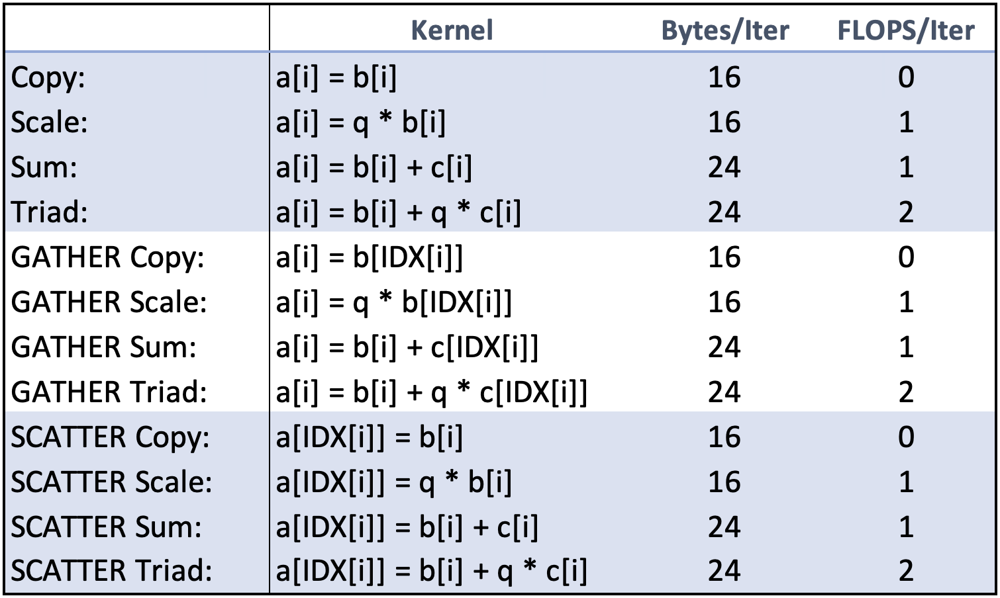
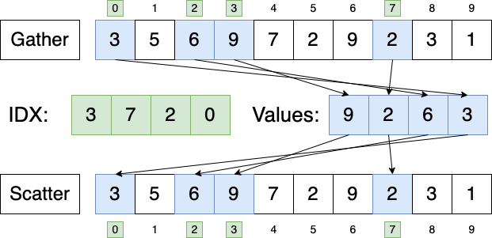
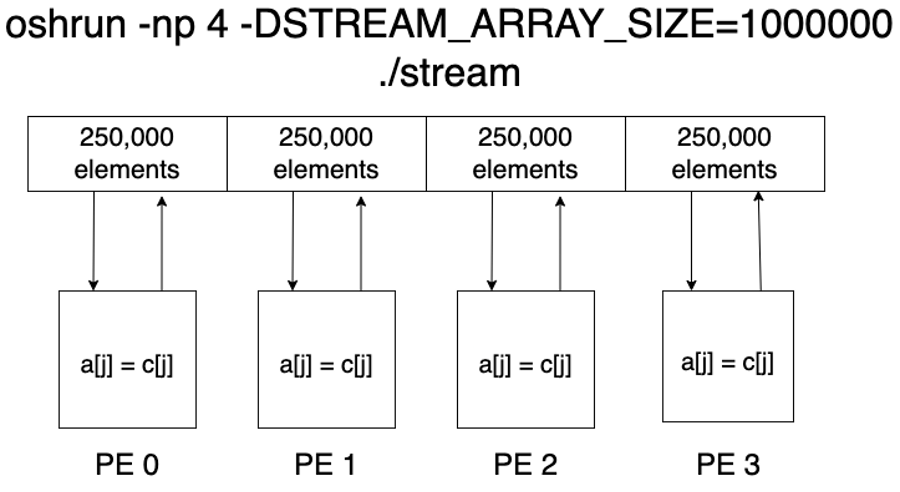

# RaiderSTREAM
---------------------------
RaiderSTREAM is a variation of the STREAM benchmark for high-performance computing (HPC), developed in the Data-Intensive Scalable Computing Laboratory at Texas Tech University.

#### How is RaiderSTREAM different from STREAM?

There are two primary limitations of STREAM with respect to HPC.
* STREAM uses sequential kernels, which is "best case scenario" memory behavior. However, this is very uncommon in HPC and scientific applications. In this setting, we typically see <i><b>irregular</b></i> memory access patterns.
* STREAM was designed to measure the memory bandwidth on a single node. However, modern HPC systems consist of many nodes.

With RaiderSTREAM, we address these two limitations by:
* Adding <i><b>gather</b></i> and <i><b>scatter</b></i> variations of the STREAM kernels to mimic the irregular memory behavior found in most scientific applications.
* Adding multi-node support by reimplementing the benchmark using the <i><b>MPI</b></i> and <i><b>OpenSHMEM</b></i> programming models

<!-- ### Table of Contents -->

### Benchmark Kernels

### Compiler Flags and Environment Variables
* `STREAM_ARRAY_SIZE`: the problem size, or the size of the STREAM arrays
    * Ex: `-DSTREAM_ARRAY_SIZE=10000000`
 
* `NTIMES`: the kernels are run on each element of the STREAM arrays `NTIMES` times. The best MB/s for each kernel amongst all `NTIMES` runs is reported in the benchmark's output.
    * Ex: `-DNTIMES=10`
 
* `STREAM_TYPE`: sets the data type used in the STREAM arrays. Set to <i>double</i> by default.
    * Ex: `-DSTREAM_TYPE=int`
 
* `DEBUG`: prints "debug" output
    * Ex: `-DDEBUG`
 
* `VERBOSE`: prints "verbose" memory usage and validation output
    * Ex: `-DBERBOSE`
 
* `TUNED`: if you look at the bottom of the .c source files, there are additional blank functions that users can write in their own custom kernels. If you want to run your custom kernels, pass in this flag.
    * Ex: `-DTUNED`

### STREAM Run Rules
STREAM is intended to measure the bandwidth from main memory. However, it can be used to measure cache bandwidth as well by the adjusting the environment variable STREAM_ARRAY_SIZE such that the memory needed to allocate the arrays can fit in the cache level of interest. The general rule for STREAM_ARRAY_SIZE is that each array must be at least 4x the size of the sum of all the lastlevel caches, or 1 million elements – whichever is larger

### Irregular Memory Access Patterns
The gather and scatter benchmark kernels are similar in that they both provide insight into the real-world performance one can expect from a given system in a scientific computing setting. However, there are differences between these two memory access patterns that should be understood.
* The gather memory access pattern is characterized by randomly indexed loads coupled with sequential stores. This can help give us an understanding of read performance from sparse datasets such as arrays or matrices.
* The scatter memory access pattern can be considered the inverse of its gather counterpart, and is characterized by the combination of sequential loads coupled together with randomly indexed stores. This pattern can give us an understanding of write performance to sparse datasets.

### Multi-Node Support
RadierSTREAM does not currently use any inter-process communication routines such as MPI_SEND or SHMEM_PUT within the benchmark kernels. Instead, the programming models are essentially leveraged as a <b>resource allocator</b>. The STREAM arrays are distributed evenly across a user-specified number of processing elements (PEs), each PE computes the kernel and writes the result back to its own array segment.

<!-- ### Citing -->