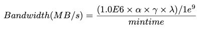
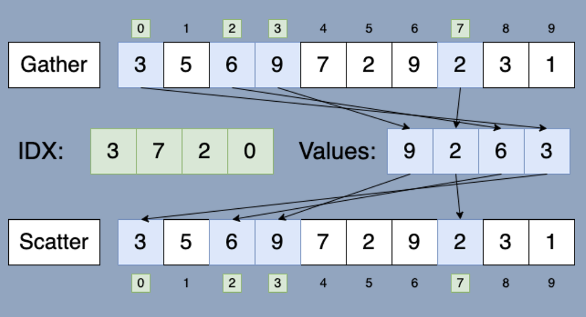
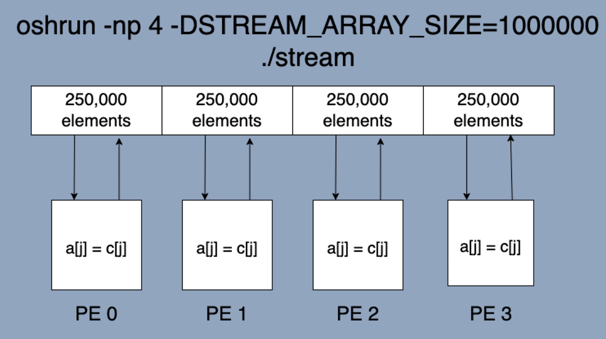

# RaiderSTREAM
---------------------------
RaiderSTREAM is a variation of the STREAM benchmark for high-performance computing (HPC), developed in the Data-Intensive Scalable Computing Laboratory at Texas Tech University.

#### How is RaiderSTREAM different from STREAM?

There are two primary limitations of STREAM with respect to HPC.
* STREAM uses sequential kernels, which is "best case scenario" memory behavior. However, this is very uncommon in HPC and scientific applications. In this setting, we typically see <i><b>irregular</b></i> memory access patterns.
* STREAM was designed to measure the memory bandwidth on a single node. However, modern HPC systems consist of many nodes.

With RaiderSTREAM, we address these two limitations by:
* Adding <i><b>gather</b></i> and <i><b>scatter</b></i> variations of the STREAM kernels to mimic the irregular memory behavior found in most scientific applications.
* Adding multi-node support by reimplementing the benchmark using the <i><b>MPI</b></i> and <i><b>OpenSHMEM</b></i> programming models

<!-- ### Table of Contents -->

### Benchmark Kernels
| Name | Kernel  | Bytes/Iter | FLOPs/Iter |
| ---- | ------- | ---------- | ---------- |
| STREAM Copy    | a[i] = b[i]            | 16 | 0 |
| STREAM Scale   | a[i] = q * b[i]        | 16 | 1 |
| STREAM Sum     | a[i] = b[i] + c[i]     | 24 | 1 |
| STREAM Triad   | a[i] = b[i] + q * c[i] | 24 | 2 |
| GATHER Copy    | a[i] = b[IDX[i]]       | 16 + sizeof(ssize_t) | 0 |
| GATHER Scale   | a[i] = q * b[IDX[i]]   | 16 + sizeof(ssize_t) | 1 |
| GATHER Sum     | a[i] = b[IDX[i]] + c[IDX[i]] | 24 + 2 * sizeof(ssize_t) | 1 |
| GATHER Triad   | a[j] = b[IDX1[j]] + q * c[IDX[j]] | 24 + 2 * sizeof(ssize_t) | 2 |
| SCATTER Copy   | a[IDX[i]] = b[i] | 16 + sizeof(ssize_t) | 0 |
| SCATTER Scale  | a[IDX[i]] = q * b[i] | 16 + sizeof(ssize_t) | 1 |
| SCATTER Sum    | a[IDX[i]] = b[i] + c[i]  | 24 + sizeof(ssize_t) | 1 |
| SCATTER Triad  | a[IDX[i]] = b[i] + q * c[i] | 24 + sizeof(ssize_t) | 2 |
| SG Copy   | a[IDX[i]] = b[i] | 16 + 2 * sizeof(ssize_t) | 0 |
| SG Scale  | a[IDX[i]] = q * b[i] | 16 + 2 * sizeof(ssize_t) | 1 |
| SG Sum    | a[IDX[i]] = b[i] + c[i]  | 24 + 3 * sizeof(ssize_t) | 1 |
| SG Triad  | a[IDX[i]] = b[i] + q * c[i] | 24 + 3 * sizeof(ssize_t) | 2 |
| CENTRAL Copy   | a[0] = b[0] | 16 | 0 |
| CENTRAL Scale  | a[0] = q * b[0] | 16 | 1 |
| CENTRAL Sum    | a[0] = b[0] + c[0] | 24 | 1 |
| CENTRAL Triad  | a[0] = b[0] + q * c[0] | 24 | 2 |

### How are bytes counted?


* $\alpha$ = number of memory accesses per iteration of the main STREAM loops
* $\gamma$ = size in bytes of `STREAM_TYPE` (8 bytes for doubles)
* $\lambda$ = `STREAM_ARRAY_SIZE`

### Setting Problem Size (STREAM_ARRAY_SIZE)
Different from the original STREAM implementation, we allow users to set the problem size at runtime to make RaiderSTREAM more suitable for automating the testing of scalability using different problem size. The easiest way to run RaiderSTREAM is using and modifying the run script to meet your use cases. You can change the `STREAM_ARRAY_SIZE` variable to set the problem size at runtime.

If you insist on compiling files individually, you can set the problem size using the `-n` flag at runtime. For example:
```
mpirun -np 2 ./stream.exe -n <desired array size>
```

### Build
Running 
```
make
```
or 
```
make all
```

from the project root directory will build each RaiderSTREAM implementation.

To build a single implementations, the following commands are available:

##### Original STREAM Implementation
```
make stream_original
```

##### Pure OpenMP
```
make stream_omp
```

##### MPI
```
make stream_mpi
```

##### OpenSHMEM
```
make stream_oshmem
```

##### CUDA (Single GPU)
```
make stream_cuda
```

##### CUDA (Multi-Node, Mutli-GPU)
```
make stream_cuda_mpi
```

##### Cleaning
Clean build directory:
```
make clean_build
```
Clean output directory:
```
make clean_outputs
```
Empty IDX1.txt and IDX2.txt:
```
make clean_inputs
```

##### Compiler Flags and Environment Variables
* `NTIMES`: the kernels are run on each element of the STREAM arrays `NTIMES` times. The best MB/s for each kernel amongst all `NTIMES` runs is reported in the benchmark's output.
    * Ex: `-DNTIMES=10`
<br/>

* `DEBUG`: prints "debug" output
    * Ex: `-DDEBUG`
<br/>

* `VERBOSE`: prints "verbose" memory usage and validation output
    * Ex: `-DBERBOSE`
<br/>

* `TUNED`: if you look at the bottom of the .c source files, there are additional blank functions that users can write in their own custom kernels. If you want to run your custom kernels, pass in this flag.
    * Ex: `-DTUNED`

* `CUSTOM`: enable this flag to use your own IDX arrays for the scatter/gather kernels. The source code will read inputs from IDX1.txt and IDX2.txt.
    * Ex: `-DTUNED`

* `NUM_GPUS`: sets the number of GPUs to be used per node. If not set, it will be set to 1.
    * Ex: `-DNUM_GPUS=3`

### Custom Memory Access Patterns
To make RaiderSTREAM more configurable. We have added a simple way to input your own IDX array indices. If `-DCUSTOM` is enabled at compile time, the source code will read in the contents of IDX1.txt and IDX2.txt to the respective IDX arrays used simulate irregularity in the scatter/gather kernels.

For the OpenMP implementation, the number of array indices must match the user-specified STREAM_ARRAY_SIZE, and each array index must be on its own line in the file, otherwise an error will occur.

For the MPI and OpenSHMEM implementations, the number of indices in the IDX files only needs to match STREAM_ARRAY_SIZE/numbPEs. 

To make it easier to populate these input files, we have included a file called arraygen.c, where you can write your own function for producing the indices in a way that matches your use case of interest. If that is done properly, you can populate the IDX files like so:
```
gcc arraygen.c -o arraygen.exe
./arraygen.exe > IDX1.txt
./arraygen.exe > IDX2.txt
./arraygen.exe > IDX3.txt
```

### Run Rules
STREAM is intended to measure the bandwidth from main memory. However, it can be used to measure cache bandwidth as well by the adjusting the  STREAM_ARRAY_SIZE such that the memory needed to allocate the arrays can fit in the cache level of interest. The general rule for STREAM_ARRAY_SIZE is that each array must be at least 4x the size of the sum of all the lastlevel caches, or 1 million elements – whichever is larger

### Irregular Memory Access Patterns
The gather and scatter benchmark kernels are similar in that they both provide insight into the real-world performance one can expect from a given system in a scientific computing setting. However, there are differences between these two memory access patterns that should be understood.
* The gather memory access pattern is characterized by randomly indexed loads coupled with sequential stores. This can help give us an understanding of read performance from sparse datasets such as arrays or matrices.
* The scatter memory access pattern can be considered the inverse of its gather counterpart, and is characterized by the combination of sequential loads coupled together with randomly indexed stores. This pattern can give us an understanding of write performance to sparse datasets.



### Multi-Node Support
RadierSTREAM does not currently use any inter-process communication routines such as MPI_SEND or SHMEM_PUT within the benchmark kernels. Instead, the programming models are essentially leveraged as a <b>resource allocator</b>. It is worth noting that for the multi-node implementations, each processing element DOES NOT get its own copy of the STREAM arrays. The STREAM arrays are distributed evenly across a user-specified number of processing elements (PEs), each PE computes the kernel and writes the result back to its own array segment.



<!-- ### Citing -->
