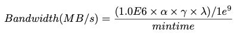
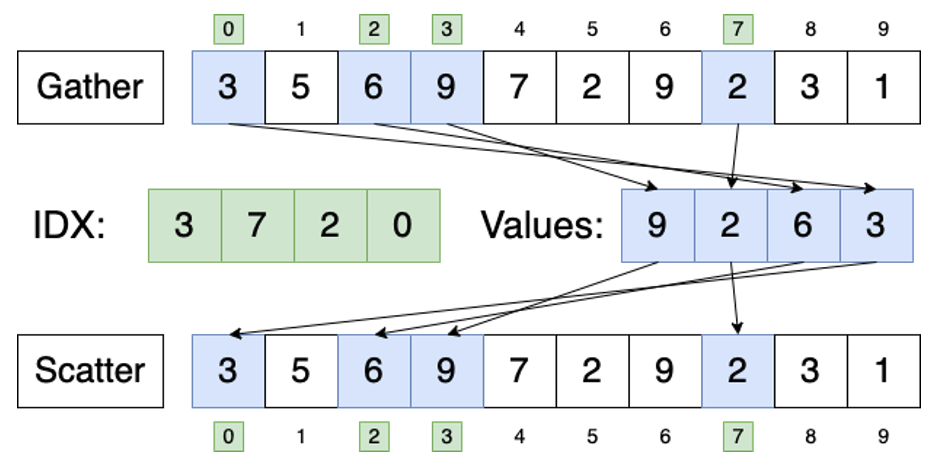
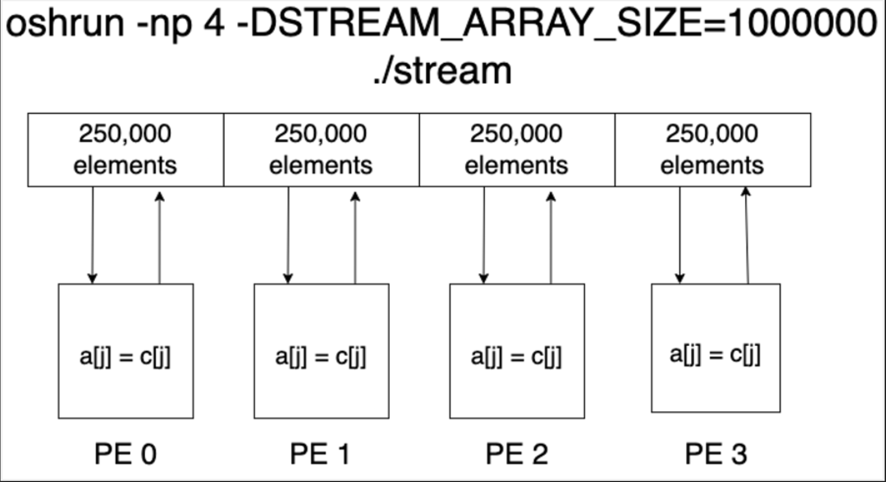

# RaiderSTREAM


RaiderSTREAM is a variation of the STREAM benchmark for high-performance computing (HPC), developed in the Data-Intensive Scalable Computing Laboratory at Texas Tech University.

## How is RaiderSTREAM different from STREAM?<a id="rstream_vs_stream"></a>

There are two primary limitations of STREAM with respect to HPC.
* STREAM uses sequential kernels, which is "best case scenario" memory behavior. However, this is very uncommon in HPC and scientific applications. In this setting, we typically see <i><b>irregular</b></i> memory access patterns.
* STREAM was designed to measure the memory bandwidth on a single node. However, modern HPC systems consist of many nodes.

With RaiderSTREAM, we address these two limitations by:
* Adding <i><b>gather</b></i> and <i><b>scatter</b></i> variations of the STREAM kernels to mimic the irregular memory behavior found in most scientific applications.
* Adding multi-process support by reimplementing the benchmark using the <i><b>MPI</b></i> and <i><b>OpenSHMEM</b></i> programming models.

## Benchmark Kernels<a id="kernels"></a>
| Name | Kernel  | Bytes/Iter | FLOPs/Iter |
| ---- | ------- | ---------- | ---------- |
| STREAM Copy    | a[i] = b[i]            | 16 | 0 |
| STREAM Scale   | a[i] = q * b[i]        | 16 | 1 |
| STREAM Sum     | a[i] = b[i] + c[i]     | 24 | 1 |
| STREAM Triad   | a[i] = b[i] + q * c[i] | 24 | 2 |
| GATHER Copy    | a[i] = b[IDX[i]]       | 16 + sizeof(ssize_t) | 0 |
| GATHER Scale   | a[i] = q * b[IDX[i]]   | 16 + sizeof(ssize_t) | 1 |
| GATHER Sum     | a[i] = b[IDX[i]] + c[IDX[i]] | 24 + 2 * sizeof(ssize_t) | 1 |
| GATHER Triad   | a[j] = b[IDX1[j]] + q * c[IDX[j]] | 24 + 2 * sizeof(ssize_t) | 2 |
| SCATTER Copy   | a[IDX[i]] = b[i] | 16 + sizeof(ssize_t) | 0 |
| SCATTER Scale  | a[IDX[i]] = q * b[i] | 16 + sizeof(ssize_t) | 1 |
| SCATTER Sum    | a[IDX[i]] = b[i] + c[i]  | 24 + sizeof(ssize_t) | 1 |
| SCATTER Triad  | a[IDX[i]] = b[i] + q * c[i] | 24 + sizeof(ssize_t) | 2 |
| SG Copy   | a[IDX[i]] = b[i] | 16 + 2 * sizeof(ssize_t) | 0 |
| SG Scale  | a[IDX[i]] = q * b[i] | 16 + 2 * sizeof(ssize_t) | 1 |
| SG Sum    | a[IDX[i]] = b[i] + c[i]  | 24 + 3 * sizeof(ssize_t) | 1 |
| SG Triad  | a[IDX[i]] = b[i] + q * c[i] | 24 + 3 * sizeof(ssize_t) | 2 |
| CENTRAL Copy   | a[0] = b[0] | 16 | 0 |
| CENTRAL Scale  | a[0] = q * b[0] | 16 | 1 |
| CENTRAL Sum    | a[0] = b[0] + c[0] | 24 | 1 |
| CENTRAL Triad  | a[0] = b[0] + q * c[0] | 24 | 2 |

## How are bytes counted?<a id="counting_bytes"></a>


* $\alpha$ = number of memory accesses per iteration of the main STREAM loops
* $\gamma$ = size in bytes of `STREAM_TYPE` (8 bytes for double, 4 bytes for int) 
* $\lambda$ = `STREAM_ARRAY_SIZE`


<!-- TODO: ## Building RaiderSTREAM<a id="build"></a> -->

<!-- TODO: ## RaiderSTREAM Options<a id="build"></a> -->


## Run Rules<a id="run_rules"></a>
STREAM is intended to measure the bandwidth from main memory. However, it can be used to measure cache bandwidth as well by the adjusting the STREAM array size such that the memory needed to allocate the arrays can fit in the cache level of interest. The general rule for STREAM array size is that each array must be at least 4x the size of the sum of all the lastlevel caches, or 1 million elements – whichever is larger

## Irregular Memory Access Patterns<a id="irregular_mem_access"></a>
The gather and scatter benchmark kernels are similar in that they both provide insight into the real-world performance one can expect from a given system in a scientific computing setting. However, there are differences between these two memory access patterns that should be understood.
* The gather memory access pattern is characterized by randomly indexed loads coupled with sequential stores. This can help give us an understanding of read performance from sparse datasets such as arrays or matrices.
* The scatter memory access pattern can be considered the inverse of its gather counterpart, and is characterized by the combination of sequential loads coupled together with randomly indexed stores. This pattern can give us an understanding of write performance to sparse datasets.
<!-- TODO: Scater-gather -->
<!-- TODO: Central -->



## Multi-process Support<a id="multi_node_support"></a>
RadierSTREAM does not currently use any inter-process communication routines such as MPI_SEND or SHMEM_PUT within the benchmark kernels. Instead, the distributed programming models are essentially leveraged as a <b>resource allocator</b>. It is worth noting that for the multi-process implementations, each processing element DOES NOT get its own copy of the STREAM arrays. The STREAM arrays are distributed evenly across a user-specified number of processing elements (PEs), each PE computes the kernel and writes the result back to its own array segment.



## Citing RaiderSTREAM<a id="citing"></a>
To cite RaiderSTREAM, please use the following reference:
* M. Beebe, B. Williams, S. Devaney, J. Leidel, Y. Chen and S. Poole, "RaiderSTREAM: Adapting the STREAM Benchmark to Modern HPC Systems," 2022 IEEE High Performance Extreme Computing Conference (HPEC), Waltham, MA, USA, 2022, pp. 1-7, doi: 10.1109/HPEC55821.2022.9926292.

BibTeX citation:
```
@INPROCEEDINGS{9926292,
  author={Beebe, Michael and Williams, Brody and Devaney, Stephen and Leidel, John and Chen, Yong and Poole, Steve},
  booktitle={2022 IEEE High Performance Extreme Computing Conference (HPEC)}, 
  title={RaiderSTREAM: Adapting the STREAM Benchmark to Modern HPC Systems}, 
  year={2022},
  volume={},
  number={},
  pages={1-7},
  doi={10.1109/HPEC55821.2022.9926292}}

```

## Acknowledgements<a id="acknowledgements"></a>
The research reported in this paper was supported by a Los Alamos National Laboratory membership contribution to the U.S. National Science Foundation Industry-University Cooperative Research Center on Cloud and Autonomic Computing (CNS-1939140), and authorized for release under LA-UR-22-29091.